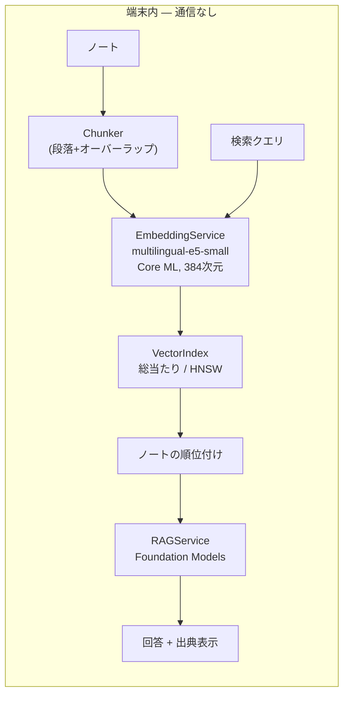

# SemanticNotes

**完全オンデバイスのセマンティック検索ノートアプリ — データは iPhone から一切出ません。**

[](https://github.com/lzt-doctor/SemanticNotes/actions/workflows/ci.yml)

*English: [README.md](README.md)*

SemanticNotes は、キーワードではなく**意味**でノートを探す iOS ノートアプリです。「how to cook rice」で
検索すると、単語が1つも一致しない「炊飯の水加減」というノートが見つかります。テキストの埋め込み・
ベクトル検索・回答生成のすべてが**端末内で完結**します。ネットワーク通信のコードは存在せず、アカウントも
クラウド同期もありません。ノートは物理的に端末の外へ出られません。

大学院出願のポートフォリオとして開発しました。単に動くアプリではなく、**問題設定 → 手法 → 定量評価**
という小さな研究として構成しています。すべての設計判断を記録し、説明できる状態を保っています
([docs/DEVLOG.md](docs/DEVLOG.md))。

## 主な結果

iPhone 17 シミュレータ上で、自作の日英ベンチマーク(ノート200件・クエリ40件)を用いて計測。
詳細は [docs/RESULTS.md](docs/RESULTS.md)。

| 指標 | 結果 |
|---|---|
| 検索品質 | recall@10 = **0.85**、nDCG@10 = **0.69** |
| 自作 HNSW vs 総当たり(N=10,000) | **0.52 ms** vs 9.25 ms/クエリ(**約18倍高速**) |
| HNSW の近似劣化 | **なし** — 総当たりと top-10 が完全一致(recall 1.00) |
| INT8 量子化 | モデル **235 → 118 MB**(50%)、品質低下は **nDCG −0.5%** のみ |
| 端末外へ出るデータ | **なし** |

## 仕組み



1. **チャンク分割** — 長いノートを1本のベクトルに潰さないよう、意味のまとまり(段落→文→強制分割)に
   オーバーラップ付きで分割します。
2. **埋め込み** — 各チャンクを [multilingual-e5-small](https://huggingface.co/intfloat/multilingual-e5-small)
   で384次元ベクトルに変換。平均プーリングと L2 正規化を Core ML モデル側に焼き込んでいます。
3. **索引と検索** — L2 正規化により**コサイン類似度 = 内積**となり、検索は行列×ベクトル1回(Accelerate/vDSP)に
   還元されます。自作の **HNSW** 索引が近似最近傍探索で大規模化に対応します。
4. **Q&A(RAG)** — 上位チャンクを根拠にオンデバイス LLM
   ([Foundation Models](https://developer.apple.com/documentation/foundationmodels))が出典付きで回答します。
   LLM が使えない環境では、検索結果そのものを根拠として表示するフォールバックに切り替わります。

## 技術スタック

- **Xcode 26 / Swift 6 / SwiftUI / SwiftData**、最低 iOS 26、MVVM + リポジトリ層
- **Core ML**(オンデバイス推論)、**Accelerate/vDSP**(ベクトル演算)
- **[swift-transformers](https://github.com/huggingface/swift-transformers)**(トークナイズ。Python 参照実装と
  トークン ID 完全一致を検証済み)
- **Foundation Models**(オンデバイス回答生成)とフォールバック
- **Swift Testing**(54テスト)+ **GitHub Actions** CI
- **Python**(PyTorch, coremltools)によるモデル変換パイプライン([`scripts/`](scripts/))

`EmbeddingService` と `VectorIndex` はプロトコルなので、テストではモックに差し替えられ、総当たりと HNSW を
同一データで公平に比較できます。

## セットアップ

### アプリのビルド

```bash
git clone https://github.com/lzt-doctor/SemanticNotes.git
cd SemanticNotes
xcodebuild -project SemanticNotes.xcodeproj -scheme SemanticNotes \
  -destination 'platform=iOS Simulator,name=iPhone 17' build
```

モデルが無くてもビルド・実行できます(検索と Q&A はモデル配置を促す案内を表示)。CI はこのモデル無しの
状態でビルドとテストを行います。

### 埋め込みモデルの生成と配置

モデル成果物はコミットしていません(大きく、再生成可能なため)。[`scripts/`](scripts/README.md) の Python
パイプラインで再生成します:

```bash
cd scripts
python3 -m venv .venv && source .venv/bin/activate
pip install -r requirements.txt
python convert_model.py     # multilingual-e5-small → Core ML (FP16)
python validate_model.py    # PyTorch との一致検証(cos > 0.999)+ テスト用参照ベクトル出力
python quantize_model.py     # 任意: INT8 版(サイズ半分)
./install_model.sh          # モデルとトークナイザを SemanticNotes/Resources/ へ配置
```

### テストの実行

```bash
xcodebuild -project SemanticNotes.xcodeproj -scheme SemanticNotes \
  -destination 'platform=iOS Simulator,name=iPhone 17' test
```

モデルや Foundation Models を要するテストは、資源が無い環境では自動的にスキップされます。重いベンチマークは
`TEST_RUNNER_RUN_BENCHMARKS=1` を付けたときだけ実行されます。

## 進捗

| フェーズ | 状態 |
|---|---|
| 0 CI・1 チャンク分割・2 モデル変換・3 埋め込み・4 総当たり検索・5 HNSW・6 評価 | ✅ 完了 |
| 7 Q&A(RAG) | 🟡 実装済み。シミュレータでフォールバック確認済み、**対応実機での生成確認待ち** |
| 8 仕上げ | 🚧 進行中(README・UI・デモ・配布) |

## プライバシー

SemanticNotes にはネットワーク通信のコードがありません。CloudKit・解析・外部サービスを一切使いません。
ノート・埋め込み・検索索引・生成された回答は、すべて端末内のローカルストレージに留まります。

## ライセンス

教育・ポートフォリオ目的のプロジェクト。ベンチマークのノートとクエリ
([`BenchmarkDataset.json`](SemanticNotesTests/Resources/BenchmarkDataset.json))はすべて本プロジェクトのために
書き下ろした自作です。
