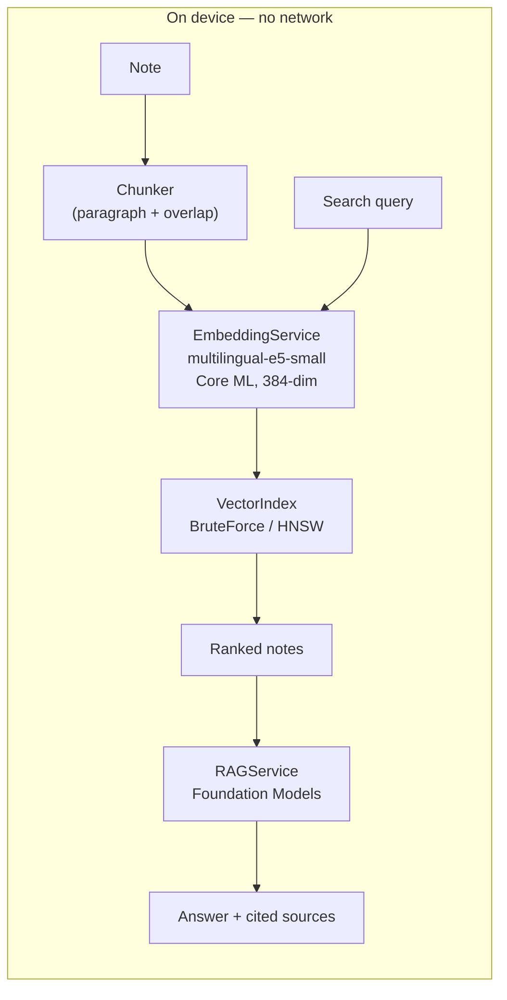

# SemanticNotes

**On-device semantic search for personal notes — nothing ever leaves your iPhone.**

[](https://github.com/lzt-doctor/SemanticNotes/actions/workflows/ci.yml)

*日本語版: [README.ja.md](README.ja.md)*

SemanticNotes is an iOS note-taking app that finds notes by **meaning**, not keywords. Search
"how to cook rice" and it surfaces your note titled "炊飯の水加減" — even though they share no words.
Every step (text embedding, vector search, and answer generation) runs **entirely on the device**.
There is no network code, no account, and no cloud sync: your notes physically cannot leave the phone.

This project was built as a graduate-school portfolio piece. It is structured as a small piece of
research — **problem → method → quantitative evaluation** — rather than just a working app. Every
design decision is documented and defensible (see [docs/DEVLOG.md](docs/DEVLOG.md)).

## Key results

Measured on an iPhone 17 simulator with a self-written bilingual (Japanese/English) benchmark of
200 notes and 40 queries. Full report: [docs/RESULTS.md](docs/RESULTS.md).

| Metric | Result |
|---|---|
| Search quality | recall@10 = **0.85**, nDCG@10 = **0.69** |
| Self-built HNSW vs. exhaustive search (N=10,000) | **0.52 ms** vs. 9.25 ms/query (**≈18× faster**) |
| HNSW approximation loss | **none** — identical top-10 to exhaustive search (recall 1.00) |
| INT8 quantization | model **235 → 118 MB** (50%), quality drop only **−0.5% nDCG** |
| Data sent off device | **none** |

## How it works



1. **Chunking** — notes are split into overlapping, meaning-sized chunks (paragraph → sentence →
   hard split) so long notes aren't averaged into one blurry vector.
2. **Embedding** — each chunk becomes a 384-dimensional vector using
   [multilingual-e5-small](https://huggingface.co/intfloat/multilingual-e5-small), converted to
   Core ML with mean-pooling and L2-normalization baked into the model.
3. **Indexing & search** — L2-normalized vectors make **cosine similarity = dot product**, so search
   reduces to one matrix–vector multiply (Accelerate/vDSP). A hand-written **HNSW** index provides
   approximate nearest-neighbor search that scales to large note counts.
4. **Q&A (RAG)** — top chunks become the grounding for an on-device LLM
   ([Foundation Models](https://developer.apple.com/documentation/foundationmodels)), which answers
   with inline source citations. If the LLM is unavailable, the app cleanly falls back to showing the
   search results themselves as the answer's evidence.

## Tech stack

- **Xcode 26 / Swift 6 / SwiftUI / SwiftData**, minimum iOS 26, MVVM + repository layer
- **Core ML** for on-device embedding inference; **Accelerate/vDSP** for vector math
- **[swift-transformers](https://github.com/huggingface/swift-transformers)** for tokenization
  (verified to match the Python reference token-for-token)
- **Foundation Models** for on-device answer generation, with a graceful fallback
- **Swift Testing** (54 tests) + **GitHub Actions** CI
- **Python** (PyTorch, coremltools) for the model-conversion pipeline in [`scripts/`](scripts/)

`EmbeddingService` and `VectorIndex` are protocols, so real Core ML / HNSW implementations can be
swapped for deterministic mocks in tests, and the brute-force and HNSW indexes can be benchmarked
on identical data.

## Getting started

### Build the app

```bash
git clone https://github.com/lzt-doctor/SemanticNotes.git
cd SemanticNotes
xcodebuild -project SemanticNotes.xcodeproj -scheme SemanticNotes \
  -destination 'platform=iOS Simulator,name=iPhone 17' build
```

The app builds and runs without the model — semantic search and Q&A simply show a setup prompt until
the model is installed. The CI builds and tests in exactly this model-free state.

### Generate and install the embedding model

Model artifacts are **not** committed (they are large and regenerable). The Python pipeline in
[`scripts/`](scripts/README.md) rebuilds them:

```bash
cd scripts
python3 -m venv .venv && source .venv/bin/activate
pip install -r requirements.txt
python convert_model.py     # multilingual-e5-small → Core ML (FP16)
python validate_model.py    # verify vs. PyTorch (cosine > 0.999) + write test reference vectors
python quantize_model.py     # optional: INT8 variant (half the size)
./install_model.sh          # copy model + tokenizer into SemanticNotes/Resources/
```

Rebuild in Xcode and the model is bundled into the app.

### Run the tests

```bash
xcodebuild -project SemanticNotes.xcodeproj -scheme SemanticNotes \
  -destination 'platform=iOS Simulator,name=iPhone 17' test
```

Tests that need the model or Foundation Models skip themselves automatically when those resources
aren't present. Heavy benchmarks (HNSW recall/latency, evaluation) run only with
`TEST_RUNNER_RUN_BENCHMARKS=1`.

## Project structure

```
SemanticNotes/          App target
  Models/               SwiftData models (Note, NoteChunk)
  Core/                 Chunker, EmbeddingService, VectorIndex (BruteForce + HNSW),
                        SearchIndexService, RAGService, and their protocols/mocks
  Views/                SwiftUI screens (note list, semantic search, Q&A)
SemanticNotesTests/     54 Swift Testing tests + self-written benchmark dataset
scripts/                Python model-conversion / validation / quantization pipeline
docs/
  PLAN.md               Phased development plan
  DEVLOG.md             Per-phase log: what was done, decisions, measurements
  RESULTS.md            Evaluation report (tables + figures)
```

## Status

| Phase | State |
|---|---|
| 0 CI · 1 Chunking · 2 Model conversion · 3 Embedding · 4 Brute-force search · 5 HNSW · 6 Evaluation | ✅ complete |
| 7 Q&A (RAG) | 🟡 implemented; fallback verified in simulator, **on-device generation pending a compatible device** |
| 8 Polish | 🚧 in progress (this README, UI, demo, distribution) |

The Foundation Models answer-generation path is implemented and its fallback is verified, but
end-to-end generation has not yet been confirmed on Apple-Intelligence-capable hardware (the
development Mac does not support it). See [docs/DEVLOG.md](docs/DEVLOG.md) for details.

## Design decisions worth reading about

These are documented in [docs/DEVLOG.md](docs/DEVLOG.md) and [docs/RESULTS.md](docs/RESULTS.md):

- Why chunk-level rather than note-level search, and the role of overlap.
- Baking mean-pooling + L2-normalization into the Core ML model (fewer places for numerical bugs).
- Why tokenizer mismatch is a *silent* failure, and how token-ID equality tests guard against it.
- Why HNSW is fast (hierarchical graph ≈ O(log N)) and how recall trades off against `efSearch` —
  including how the answer depends on data distribution (a dimensionality-of-the-curse finding).
- Why INT8 quantization halves the model with almost no quality loss (search uses *rank*, not exact
  coordinates).

## Privacy

SemanticNotes contains no networking code. It does not use CloudKit, analytics, or any remote
service. Notes, embeddings, the search index, and generated answers all stay in the app's local
storage on the device.

## License

Educational / portfolio project. The benchmark notes and queries in
[`SemanticNotesTests/Resources/BenchmarkDataset.json`](SemanticNotesTests/Resources/BenchmarkDataset.json)
were written from scratch for this project.
