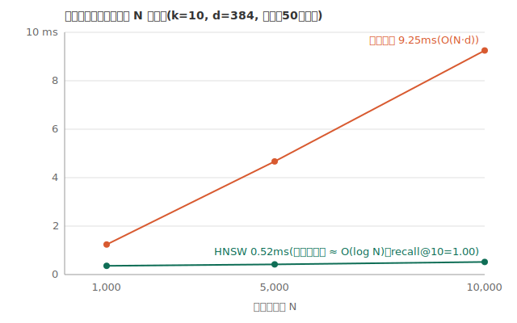
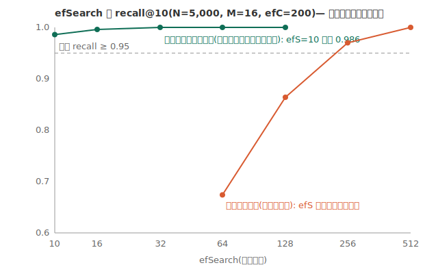
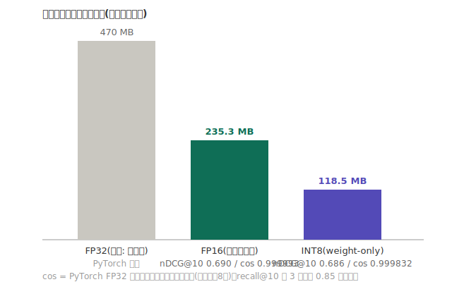

# SemanticNotes 評価結果

完全オンデバイスのセマンティック検索ノートアプリにおける、検索品質・速度・メモリの定量評価。
データはすべて端末内で処理され、外部に送信されない。

## 要約

| 項目 | 結果 |
|---|---|
| 検索品質(ラベル付き評価) | recall@10 = **0.85**、nDCG@10 = **0.69**(日英40クエリ) |
| HNSW の近似劣化 | 検索品質の低下**なし**(真の top-10 との一致率 1.00) |
| 検索速度(N=10,000) | HNSW **0.52 ms**/クエリ(総当たり 9.25 ms の **約1/18**) |
| INT8 量子化 | サイズ **235→118 MB(50%)**、nDCG@10 の低下は **0.004(−0.5%)** |
| 端末から出るデータ | なし(ネットワーク通信を行わない設計) |

## 1. 評価環境

- Apple Silicon Mac 上の iPhone 17 シミュレータ(iOS 26.5)、Xcode 26.6、Debug ビルド
- 埋め込みモデル: intfloat/multilingual-e5-small(384次元)を Core ML へ変換(平均プーリング+L2正規化を焼き込み)
- 比較対象: `BruteForceIndex`(vDSP による厳密解)と自作 `HNSWIndex`(M=16, efConstruction=200, efSearch=64)
- 再現方法: `TEST_RUNNER_RUN_BENCHMARKS=1` を付けて `SemanticNotesTests/EvaluationBenchmarks`・`HNSWBenchmarks` を実行

## 2. データセット(自作)

既存の記事・書籍等を流用せず、本評価のために書き下ろした日英ミニベンチマーク
([SemanticNotesTests/Resources/BenchmarkDataset.json](../SemanticNotesTests/Resources/BenchmarkDataset.json))。

- ノート **200件**: 20トピック(日本語系12・英語8)× 各10件。料理・筋トレ・旅行・仕事・家計・園芸・プログラミング・写真・デバッグなど、個人メモを模した内容
- クエリ **40件**(日本語24・英語16): 本文と語彙が重ならない「意味的な言い換え」で作成(例:「腰を痛めないバーベルの持ち上げ方」→ 正解ノートは「デッドリフトの注意」)
- 正解ラベル: クエリごとに等級付きで付与(**2 = 直接の答え**、**1 = 関連**。1クエリあたり1〜2件)

## 3. 指標の定義

- **recall@10** — ラベル付き関連ノートのうち、検索上位10件に入った割合。「探しているものが画面に出るか」
- **nDCG@10** — 順位を考慮した品質。利得 2^等級−1 を位置 i の割引 log2(i+1) で重み付けし、理想順位で正規化。「上の方に出るか」まで測る
- **真 top-10 一致率** — 総当たり(厳密解)の top-10 と HNSW の top-10 の重なり。ラベルと無関係に「近似による劣化」だけを分離して測る

## 4. 検索品質

| 構成 | recall@10 | nDCG@10 | 真top10一致 |
|---|---|---|---|
| 総当たり + FP16 | 0.850 | 0.690 | (厳密解) |
| HNSW + FP16 | 0.850 | 0.690 | 1.000 |
| 総当たり + INT8 | 0.850 | 0.686 | (厳密解) |
| HNSW + INT8 | 0.850 | 0.686 | 1.000 |

言語別(FP16・総当たり):

| 言語 | クエリ数 | recall@10 | nDCG@10 |
|---|---|---|---|
| 日本語 | 24 | 0.875 | 0.706 |
| 英語 | 16 | 0.813 | 0.666 |

**誤り分析**: recall が 1.0 に届かなかった9クエリの大半は、等級1(周辺関連)のラベルが
top-10 圏外だったもので、等級2(直接の答え)はほぼ全クエリで上位に入った。
完全な取りこぼしは「作業時間の予測を外したときの反省 → 見積もりの反省」など、
抽象度の高い言い換え1件程度で、これは 384 次元の小型モデルの表現力の限界と考えられる。

## 5. 検索速度

エンドツーエンドの内訳(N=200、実測)は、クエリ埋め込み **約30 ms** が支配的で、
インデックス検索は 1 ms 未満。インデックス側のスケーリングを合成データ
(実埋め込みに近いクラスタ構造、d=384、クエリ50件平均、シード固定)で測ると:

| N | 総当たり | HNSW | 倍率 | HNSW recall@10(対 厳密解) |
|---|---|---|---|---|
| 1,000 | 1.24 ms | 0.36 ms | ×3.5 | 1.00 |
| 5,000 | 4.67 ms | 0.42 ms | ×11.2 | 1.00 |
| 10,000 | 9.25 ms | **0.52 ms** | **×17.9** | 1.00 |



総当たりは O(N·d) どおり N に比例して伸び、HNSW はほぼ横ばい(≈ O(log N))。
倍率は N とともに拡大するため、ノートが増えるほど HNSW の価値が上がる。
なお現状のノート規模(数百件)では総当たりでも 1 ms 未満であり、
アプリの既定インデックスは単純さを優先して総当たりのままにしている。

## 6. HNSW のパラメータと頑健性

efSearch(検索ビーム幅)の掃引。データ分布によって recall が大きく変わる:



- **クラスタ構造データ**(実埋め込みに近い): efS=10 でも recall 0.986、32 以上で 1.0。既定値 efS=64 は安全側
- **一様ランダム**(次元の呪いの最悪ケース): efS=64 で 0.674 まで落ちるが、efS=512 で 1.0 に回復 — グラフは健全で、「速度を払えば精度を買い戻せる」というつまみとして機能する

M と efConstruction(クラスタ構造、N=5,000、efS=64): recall はどの構成でも ≈1.0 のため、
構築時間で選ぶ。M=16 / efC=200 の構築 14.2 秒に対し M=8 / efC=100 なら 4.8 秒で同品質。
既定値は難しいデータへの余裕を見て M=16 / efC=200 とした。

## 7. 量子化(FP16 vs INT8)



| モデル | サイズ | PyTorch との最小 cos | recall@10 | nDCG@10 |
|---|---|---|---|---|
| FP32(参考・変換前) | 約470 MB | 1.0(基準) | — | — |
| FP16(採用) | 235.3 MB | 0.999993 | 0.850 | 0.690 |
| INT8(weight-only) | 118.5 MB | 0.999832 | 0.850 | **0.686** |

**考察**: INT8 化でベクトルの誤差は1桁増える(cos 0.999993 → 0.999832)が、
検索は「順位」しか使わないため、僅かな座標のずれは上位の順序をほとんど入れ替えない。
実際、取りこぼしたクエリの顔ぶれは FP16 と完全に同一だった。
weight-only 量子化(重みのみ8ビット、計算は FP16)を選んだことで、
劣化源が重みの丸め誤差だけに限定されていることも効いている。
**ストレージが厳しい端末向けには INT8 版(半分のサイズ)が実用的な選択肢**と言える。

## 8. メモリ・ストレージ

| 項目 | サイズ | 備考 |
|---|---|---|
| 埋め込みモデル FP16 | 235.3 MB | アプリに同梱 |
| tokenizer.json ほか | 約16 MB | 同上 |
| ベクトル本体(N=10,000) | 約15.4 MB | 384次元 × 4バイト/チャンク |
| HNSW グラフ追加分(N=10,000) | 約1.5 MB | リンク約34本/ノード × 4バイト |
| 参考: 1チャンクあたり | 約1.7 KB | ベクトル1,536B + リンク+ID 約170B |

## 9. 限界と今後の課題

1. **測定環境**: シミュレータ+Debug ビルドの数値であり、実機(A系チップ)・Release ビルドでは絶対値が変わる。相対比較(倍率・劣化率)は保たれる見込みだが、実機計測は今後の課題
2. **データセット規模**: 200ノート・40クエリ・作者自身によるラベル付けであり、統計的な信頼区間は広い。ラベルの網羅性(関連ノートの見落とし)は recall を過小評価する方向に働く
3. **スケーリング実験は合成データ**: 1万件の実ノートを用意できないため、クラスタ構造の合成ベクトルで代用した。分布依存性は第6節のとおり定量化済み
4. **単一モデル**: 別の埋め込みモデルとの比較(PLAN の発展項目)は未実施

## 再現手順

```bash
# モデルの変換・量子化・配置(scripts/README.md 参照)
cd scripts && source .venv/bin/activate
python convert_model.py && python validate_model.py && python quantize_model.py
./install_model.sh

# 評価の実行
TEST_RUNNER_RUN_BENCHMARKS=1 xcodebuild -project SemanticNotes.xcodeproj \
  -scheme SemanticNotes -destination 'platform=iOS Simulator,name=iPhone 17' \
  test -only-testing:SemanticNotesTests/EvaluationBenchmarks \
       -only-testing:SemanticNotesTests/HNSWBenchmarks
```
